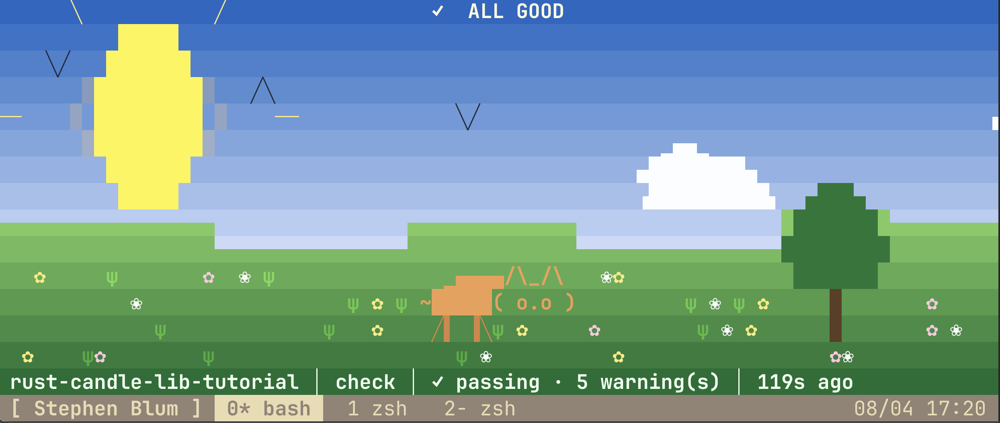
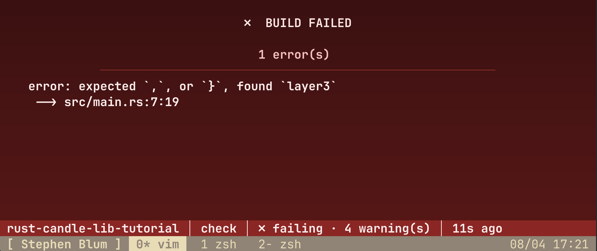

# Rust Bacon Visuals and Sounds

An animated terminal dashboard for [bacon](https://dystroy.org/bacon), the
background Rust code checker. Drop `bacon.toml` and `bacon-tui.sh` into a Rust
project and get a live scene that turns green when the build is clean, amber
while compiling, and pulses red on errors — with sound.





## Install

Install bacon with the `sound` feature (required for the success/failure chimes
configured in `bacon.toml`):

```sh
cargo install --locked --features sound bacon
```

Then copy `bacon.toml` and `bacon-tui.sh` into the root of your Rust project —
the directory holding its `Cargo.toml`:

```sh
cp bacon.toml YOUR_PROJECT_FOLDER/.
cp bacon-tui.sh YOUR_PROJECT_FOLDER/.
```

Both files belong at the project root: bacon reads `bacon.toml` from the
directory you launch it in, and `bacon-tui.sh` runs `cargo` there too. If your
project already has a `bacon.toml`, merge the `[sound]` and `[jobs.*]` sections
in rather than overwriting it.

## Run

Run from your project root:

The animated dashboard, which runs `bacon --headless` for you and renders its
JSON report:

```sh
./bacon-tui.sh            # job defaults to check
./bacon-tui.sh clippy     # check | check-all | clippy | test
```

Plain bacon, using this repo's `bacon.toml`:

```sh
bacon              # default job: check
bacon clippy       # or check-all, test
```

Keys: `q` quit · `1`-`4` switch job · `r` rerun · `l` cycle log view · `p` pause
animation.

Needs a truecolor terminal (iTerm2, WezTerm, Ghostty, Kitty, or tmux with 24-bit
color).
